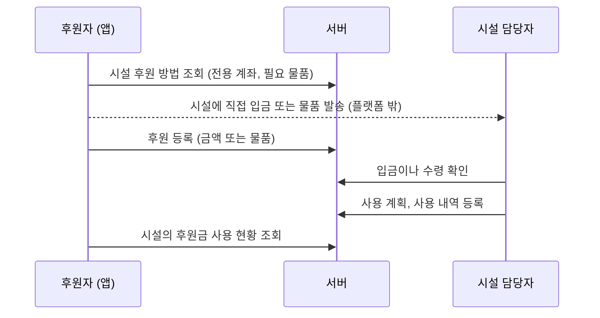
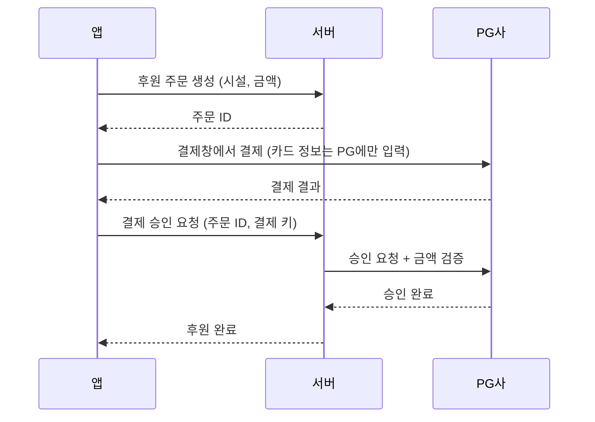

# 아키텍처

> 상태: 뼈대 (구현 전). 구현하면서 "계획"을 실제 구조로 바꿔 나간다.
> 버전은 [버전 및 호환성](versions.md), 기술 선택 이유는 [프로젝트 개요](overview.md)를 참고한다.

## 1. 목적과 핵심 기능
**보육원에 대한 정리된 정보를 쉽게 찾아보고, 물품이나 금전 후원을 간편하게 할 수 있게 한다.**
최근 개인정보 유출 사고가 늘고 있으므로 **보안을 설계 단계부터 최우선으로** 고려한다.

| 기능 | 설명 | 문서 |
|---|---|---|
| 보육원 지도 | 지도에서 보육원 위치와 정보 확인 | [보육원 지도](features/orphanage-map.md) |
| 시설 정보 관리 | 인증된 시설 담당자가 세부 정보를 직접 입력 | [시설 담당자 정보 관리](features/facility-management.md) |
| 후원 | 후원자와 시설 직접 연결, 후원 및 사용 내역 기록 | [후원](features/donation.md) |
| AI 검색 | 자연어 질문으로 보육원 찾기 | [AI 보육원 검색](features/ai-search.md) |

## 2. 시스템 구성도

```mermaid
flowchart LR
    subgraph Client["클라이언트"]
        APP["Android 앱<br/>Kotlin + Compose"]
        WEB["웹 (예정)<br/>Next.js"]
    end

    subgraph Server["서버: Spring Boot 4.1 / Java 25"]
        API["REST API<br/>+ Spring Security"]
    end

    subgraph Data["데이터"]
        DB[("PostgreSQL 18<br/>+ pgvector (예정)")]
        FILE[("파일 저장소 (미정)<br/>증빙 서류, 시설 사진")]
    end

    subgraph External["외부 서비스"]
        MAP["네이버 지도<br/>SDK, Geocoding"]
        PG["결제 대행사 PG<br/>(B안, 보류)"]
        LLM["LLM API (미정)"]
    end

    APP -->|HTTPS| API
    WEB -->|HTTPS| API
    APP -.->|지도 표시| MAP
    API --> DB
    API --> FILE
    API -->|주소→좌표| MAP
    API -.->|결제 승인과 검증 (보류)| PG
    API -->|검색 조건 추출, 답변 생성| LLM
```

- 클라이언트는 **서버 API만** 호출한다. DB, 파일 저장소, LLM, 결제 비밀 키에 직접 접근하지 않는다.
- 예외적으로 지도 표시는 클라이언트가 네이버 지도 SDK를 직접 쓴다. 이때는 공개용 Client ID만 쓴다.

## 3. 저장소 구조

```
bobohu/
├── CLAUDE.md          # 위키 운영 규칙, 보안 원칙
├── docs/              # 지식 위키, 트러블슈팅, 원본 자료
├── server/            # Spring Boot API 서버
│   ├── compose.yaml   # 로컬 개발용 PostgreSQL 18
│   ├── .env.example   # 로컬 비밀 정보 형식 (.env는 git 제외)
│   └── src/main/java/com/bobohu/
│       ├── BobohuServerApplication.java
│       ├── common/
│       │   ├── config/    # SecurityConfig, JpaConfig
│       │   └── domain/    # BaseTimeEntity (생성, 수정 시각)
│       └── facility/
│           └── domain/    # Facility, FacilityType, FacilityRepository
├── android/           # Android 앱 (예정)
└── web/               # 웹 (예정)
```
하나의 저장소에 서버, 앱, 웹을 함께 둔다(모노레포). 혼자 개발하므로 문서와 코드를 한곳에서 관리하는 편이 낫다.

## 4. 서버 구조 (계획)

### 4.1 모듈러 모놀리스로 시작
서버는 하나로 배포하되, 안쪽은 도메인별로 나눈다. 혼자 개발하는 규모에서 마이크로서비스는 운영 부담만 크다. 대신 도메인 경계를 지켜 두면 나중에 필요한 부분만 분리할 수 있다.

| 도메인 모듈 | 책임 |
|---|---|
| `user` | 회원가입, 로그인, 토큰, 역할 |
| `facility` | 시설 정보, 담당자 인증 요청과 승인 |
| `donation` | 후원 연결, 후원 내역과 사용 내역 기록(원장), 사용 계획 |
| `search` | 지도 검색, AI 검색 (Function Calling, RAG) |
| `admin` | 담당자 승인, 신고 처리, 감사 로그 조회 |
| `common` | 보안 설정, 예외 처리, 암호화, 로깅 |

### 4.2 계층 구조
`Controller → Service → Repository`. 외부 API(지도, PG, LLM)는 인터페이스 뒤에 숨겨서 교체할 수 있게 하고, 테스트에서는 가짜 구현으로 바꾼다.

패키지 구조는 첫 구현을 할 때 확정한다.

## 5. 주요 흐름 (계획)

### 5.1 시설 정보 조회
앱 → `GET /facilities?bounds=...` → 서버가 지도 화면 범위 안의 시설을 조회해서 응답 → 앱이 마커 표시

### 5.2 담당자 인증
담당자 가입 → 시설 등록 요청 + 증빙 서류 업로드 → 관리자 승인 → 담당자 권한 부여 → 해당 시설 정보만 수정 가능
상세 내용은 [시설 담당자 정보 관리](features/facility-management.md) 참고

### 5.3 후원 (A안: 직접 연결, 우선 진행)
플랫폼은 돈을 받지도, 보관하지도, 전달하지도 않는다. 자세한 내용은 [후원](features/donation.md) 참고.

- 후원, 사용 기록은 **수정이나 삭제 없이 추가만** 한다. 틀린 내용은 정정 기록으로 바로잡는다.
- 잔액은 저장하지 않고 내역에서 계산한다.

### 5.4 금전 후원 (B안, 보류)
법률 전문가 검토 전에는 구현하지 않는다. 검토 후 진행한다면 아래 흐름을 따른다.

- 카드 정보는 PG사가 처리한다. 우리 서버와 DB는 **카드 정보를 받지도 저장하지도 않는다.**
- 결제 금액은 서버에 저장된 주문 금액과 비교해서 검증한다. 클라이언트가 보낸 금액을 그대로 믿지 않는다.
- 같은 요청이 두 번 와도 한 번만 처리되게 한다(멱등성).

### 5.5 AI 검색
[AI 보육원 검색](features/ai-search.md) 참고. LLM은 DB에 직접 접근하지 않는다.

## 6. 보안 아키텍처

### 6.1 원칙
1. **최소 수집**: 서비스에 꼭 필요한 개인정보만 받는다. 받지 않은 정보는 유출될 일도 없다.
2. **최소 권한**: 사용자, 담당자, 관리자, 서버 내부 구성요소 모두 필요한 권한만 가진다.
3. **다층 방어**: 한 겹이 뚫려도 다음 겹이 막도록 여러 단계로 보호한다.
4. **기본값은 거부**: 명시적으로 허용하지 않은 요청은 모두 막는다.

### 6.2 다루는 민감 정보
| 정보 | 누구의 정보 | 보호 방법 (계획) |
|---|---|---|
| 비밀번호 | 모든 회원 | 단방향 해시 (BCrypt 또는 Argon2). 원문을 저장하지 않는다 |
| 이름, 연락처, 이메일 | 후원자, 담당자 | 컬럼 단위 암호화 (AES-GCM). 화면과 로그에서는 마스킹 |
| 배송 주소 | 물품 후원자 | 컬럼 단위 암호화. 배송이 끝나면 보관 기간 후 파기 |
| 증빙 서류 | 시설 담당자 | 비공개 저장소. 관리자만 접근. 모든 접근을 기록. 인증 후 보관 기간이 지나면 파기 |
| 결제 정보 | 후원자 | **저장하지 않는다.** A안은 플랫폼이 결제를 다루지 않는다. B안에서도 PG사에 위임하고 결제 키와 결과만 저장 |
| 후원금 사용 증빙 | 시설 | 공개 정보. 올리기 전에 개인정보(카드 번호, 주소 등)를 가리도록 안내 |
| 아동 개인정보 | 시설 아동 | **받지 않는다.** 집계 정보(인원 수)만 받는다 |

### 6.3 인증과 인가
- **인증**: 방식(JWT 또는 세션)은 구현할 때 결정한다. JWT라면 Access Token은 짧게, Refresh Token은 서버에서 관리하고 사용할 때마다 새로 발급한다(rotation).
- **담당자와 관리자는 2단계 인증(MFA)** 적용을 검토한다.
- **인가**: 역할 기반(RBAC: 사용자, 담당자, 관리자)에 **리소스 소유권 확인**을 더한다. 예를 들어 담당자는 "담당자 역할"이 있더라도 **자기 시설만** 수정할 수 있다. URL의 ID만 바꿔서 남의 데이터에 접근하는 공격(IDOR)을 막는다.
- 로그인 시도 횟수 제한으로 무차별 대입 공격을 막는다.

### 6.4 데이터 보호
- **전송 구간**: 모든 통신에 HTTPS(TLS)를 쓴다.
- **저장 구간**: 민감한 컬럼은 암호화한다. 암호화 키는 코드와 DB에서 분리해서 관리한다.
- **비밀 정보 관리**: API 키, DB 비밀번호, 암호화 키는 환경 변수나 비밀 관리 서비스에 둔다. **git에 절대 올리지 않는다.** 커밋 전에 비밀 정보가 섞였는지 검사하는 도구 도입을 검토한다.
- **보관과 파기**: 개인정보마다 보관 기간을 정하고, 기간이 지나면 자동으로 파기한다.

### 6.5 애플리케이션 보안 (OWASP Top 10 대응)
| 위협 | 대응 (계획) |
|---|---|
| SQL 인젝션 | JPA와 파라미터 바인딩만 쓴다. 문자열로 쿼리를 이어 붙이지 않는다 |
| 권한 우회 (IDOR) | 모든 수정 API에서 리소스 소유자인지 확인한다 |
| XSS | 담당자가 입력한 텍스트는 출력할 때 이스케이프한다 |
| 악성 파일 업로드 | 확장자와 실제 파일 형식을 검사하고 크기를 제한한다. 업로드 파일은 실행할 수 없는 비공개 저장소에 둔다 |
| 후원 기록 위변조 | 기록은 추가만 가능하고, 확인과 정정은 권한 있는 담당자만 할 수 있다. 모든 변경을 이력으로 남긴다 |
| 결제 위변조 (B안) | 서버에서 금액을 검증하고, PG 웹훅은 서명을 검증한다 |
| 과도한 요청 | API별 요청 횟수 제한(Rate Limiting) |
| 취약한 라이브러리 | 의존성 취약점을 자동으로 검사한다 (Dependabot 등) |

### 6.6 AI 기능 보안
- LLM에 **개인정보를 보내지 않는다.** 시설의 공개 정보만 보낸다.
- LLM이 호출할 수 있는 함수는 **읽기 전용 검색**으로 제한한다.
- 담당자가 쓴 소개글에 LLM을 조종하려는 문장이 들어갈 수 있다(프롬프트 인젝션). 그래서 RAG로 가져온 텍스트는 "지시가 아니라 데이터"로 다루고, LLM이 무엇을 하든 할 수 있는 일은 검색 함수 호출뿐이게 만든다.

### 6.7 앱 보안 (Android)
- 토큰은 Android Keystore 기반으로 암호화해서 저장한다. 평문으로 저장하지 않는다.
- 앱 안에 비밀 키를 넣지 않는다. 앱은 디컴파일할 수 있다고 가정한다.
- 릴리스 빌드에는 코드 난독화(R8)를 적용한다.

### 6.8 감사와 모니터링
- 관리자의 개인정보 조회, 증빙 서류 열람, 권한 변경을 **감사 로그**로 남긴다.
- 애플리케이션 로그에는 개인정보를 남기지 않는다(마스킹).
- 비정상 접근(로그인 실패 급증 등)을 감지하는 방법은 배포 단계에서 정한다.

## 7. 배포 구조
미정. 클라우드 환경, 컨테이너 사용 여부, CI/CD는 MVP 구현 후 정한다.

## 8. 미정 사항과 확인할 것
- [ ] 인증 방식: JWT 또는 세션
- [ ] 파일 저장소
- [ ] 후원 A안(직접 연결)의 법적 문제 여부, B안(플랫폼 결제)에 필요한 등록과 인허가: 법률 전문가 확인. [후원](features/donation.md#법적-검토-2026-09-25-조사-전문가-검토-필요) 참고
- [ ] 개인정보 항목별 보관 기간
- [ ] 개인정보 처리방침과 이용약관
- [ ] 배포 환경
